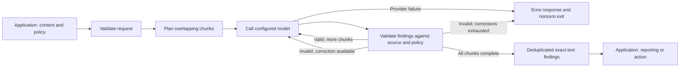

# Content Classifier

Classify files and conversations with an LLM through a standalone executable.
Send a JSON request with your instructions and categories; receive findings that
quote exact text from the original content.

Content Classifier handles token estimation, overlapping chunks, model calls, and
finding validation. Your application decides what to scan and how to report,
review, or transform the results.

## How it works



Files reach the model as plain multiline content with path and line-range context.
Conversations retain their roles, source segments, and context boundaries. Findings
contain text, category, and reason; they do not contain positions or edited content.
A failed chunk fails the invocation, so an error never means a clean result.

## Quick start

Build with Bun 1.4.2:

```sh
bun install --frozen-lockfile
bun run build
cp config.example.json config.json
```

Edit `config.json` with your endpoint, model, authentication, and token budgets.
The example selects Qwen with reasoning disabled; use
[`config.gpt-oss.example.json`](config.gpt-oss.example.json) for low reasoning effort.
Both contain placeholder endpoints, not hosted services.

Run the supplied conversation request:

```sh
./dist/content-classifier --config ./config.json < fixtures/request-v4.json
```

The binary uses system certificate authorities and needs no separate Bun
interpreter at runtime. Each invocation processes one request and exits.

## Use it from your application

1. Start the executable with `--config PATH`.
2. Write one version-4 request to stdin and close it. Include a policy and either
   a file or conversation target.
3. Read stdout and stderr concurrently and enforce your process limits.
4. Accept results only when the process exits zero and the version-2 response
   has `status: "complete"`.
5. Locate each returned substring in the source and apply your own policy.

A successful response looks like this:

```json
{
  "version": 2,
  "status": "complete",
  "findings": [
    {
      "text": "exact source substring",
      "category": "credential",
      "reason": "embedded_secret"
    }
  ]
}
```

An empty `findings` array means no matches. Repeated identical strings have no
occurrence-specific distinction. Classification is a model judgment; exact-text
validation confirms that findings exist in the source, not that every judgment
is correct.

Add `--progress` to receive metadata-only JSONL progress on stderr. Without it,
ordinary stderr is empty. Configuration uses version 3 and is read afresh on each
invocation; instructions and categories are supplied in the request.

## Documentation

| Guide                                                                    | Covers                                                                                                  |
| ------------------------------------------------------------------------ | ------------------------------------------------------------------------------------------------------- |
| [Executable integration](docs/integration.md)                            | Requests, file and conversation targets, policies, responses, errors, progress, and private diagnostics |
| [Configuration](docs/configuration.md)                                   | Model connection, authentication, certificates, token budgets, and limits                               |
| [Development and testing](docs/development.md)                           | Local checks, builds, and opt-in live model tests                                                       |
| [Credential audit policy example](examples/credential-audit-policy.json) | A caller-supplied policy for distinguishing credentials from synthetic examples                         |
